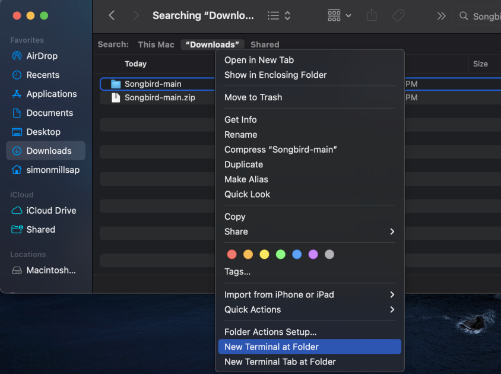
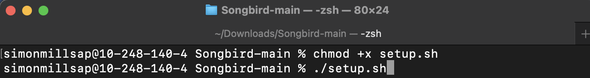
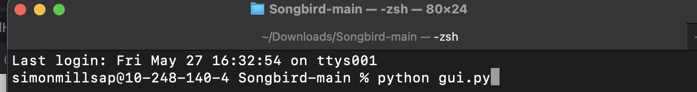

# Crossbill Heartbeat Filtering and Peak Counting
Megan Black, Violet Kurtz, Kristina Marquez, Simon Millsap

The filtering algorithm works to detect the most probable carrier frequency and extracts it. Then,
the signal is demodulated to find the real heartbeat signal among the noisy data. Filtering of the
data closely mimics the manipulation of the data that the original researcher performed in order
to more clearly detect the peaks for hand counting. The peak counting algorithm utilizes a
function in the Python library SciPy that takes in sound data along with a few data parameters,
and determines the number of peaks in the data. With the number of peaks, it is a simple
calculation to determine the average beats per minute of any segment of data. The project was
determined to be successful and fairly accurate according to the testing performed.
## Program Requirements
### Hardware:
Laptop or desktop that can run Python (directions written for MacOS, please reach out if using a
different operating system)
### Software:
Python 3, Pip
### Dependencies:
Tkinter, matplotlib, numpy, scipy.io, math, PIL (version numbers viewable in requirements.txt)
## Usage
To use this program
1. Download zip from this repository: https://github.com/OniLink/Songbird.git
* Click on green “Code” button
* Download zip
* Unzip the zip file
2. Navigate to the folder of the uncompressed zip file, right click the folder and select “New
Terminal at Folder” to open the command prompt (commonly referred to as a terminal)
like so: 
3. Into the command prompt, type ```chmod +x setup.sh``` and press enter.
4. Then type ```./setup.sh``` and press enter.
 
Some things will begin to install. 
5. After that everything should be set up! Anytime you want to open up this application in
the future, simply open up a command prompt at this location as before and just type
```./setup.sh```
6. To actually run the gui, in the command prompt just type ```python gui.py``` and press enter. 

8. To find a .wav file on your computer to use, click the “Search” button
9. Click “Filter” to filter a file, or “Read” to view an already filtered file.
10. Adjust range to fit interval needs, then click “Adjust Range” to refresh interval
11. Adjust sliders so that it looks like all the peaks in interval are being counted (Tips on this step are stated below)
12. The program will output a file called filtered_file.wav which is available for you to use if
you want to view the file again with the “Read” button, or for further inspection in tools
like Audacity if desired.
## Sliders
### Period:
This slider adjusts the period where bird heartbeats are captured and will ignore everything in
between, for adjusting, The max value of the slider makes it capture a larger range of periods at
the cost of catching more false peaks.
### Prominence:
This slider adjusts what the code looks for in the difference between the highest peak and the
median line, this helps the code pick out the peaks with more ease. It is recommended to keep
this at 1 for well filtered data, and to adjust it to lower values when the data is more noisy. The
max value allows for more of a difference in peak heights to be detected, the lower the value, the
more lenient the prominence will be.
### Tip:
A recommendation for sifting through the data is that when the data looks irregular, it is best to
use a smaller interval of time
## Demo Link
https://www.youtube.com/watch?v=bSxV2Pfvxkk
## Unrealized Features:
- Scrollable Graph
- Accounting for Crossbill Double Peaks*
  
  *Tuning the slider can account for double peaks, but if the slider is tuned for single peaks it will skip past double peaks. There is no specific implementation for double peaks as of now.
